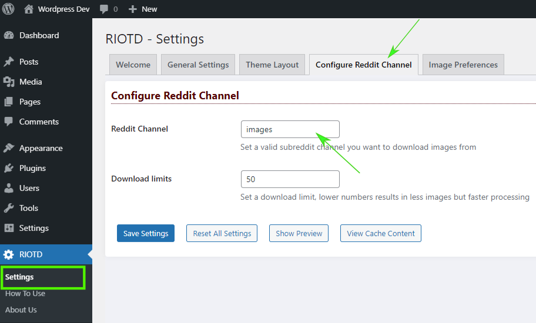
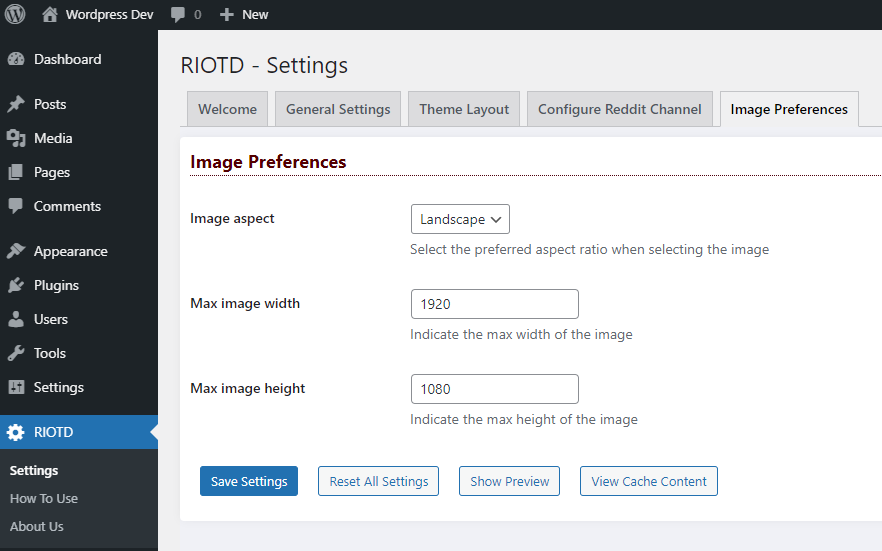
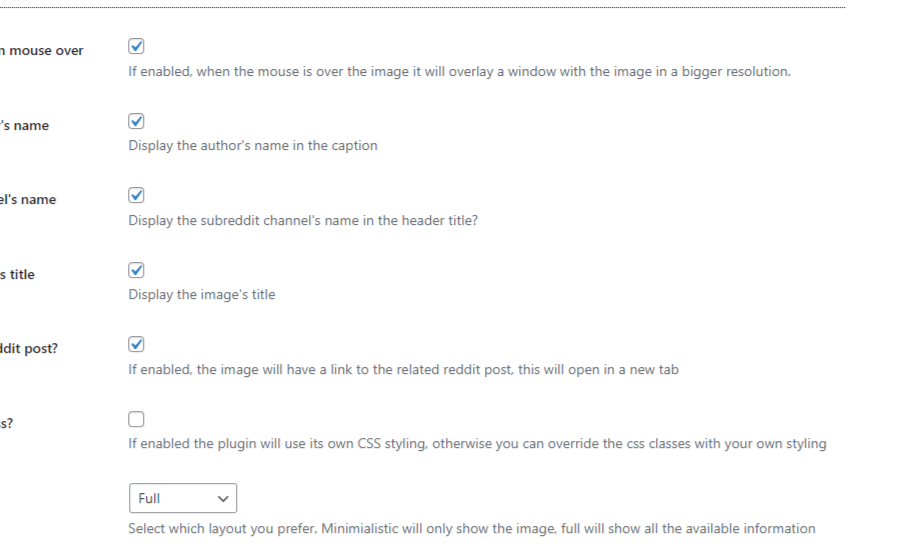
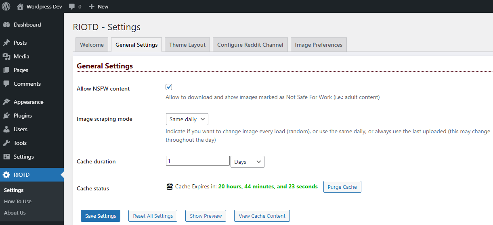
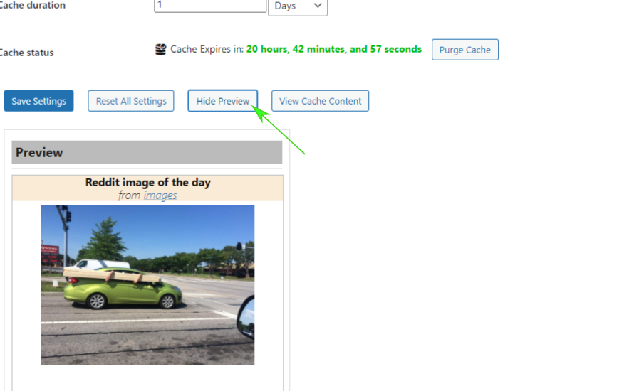
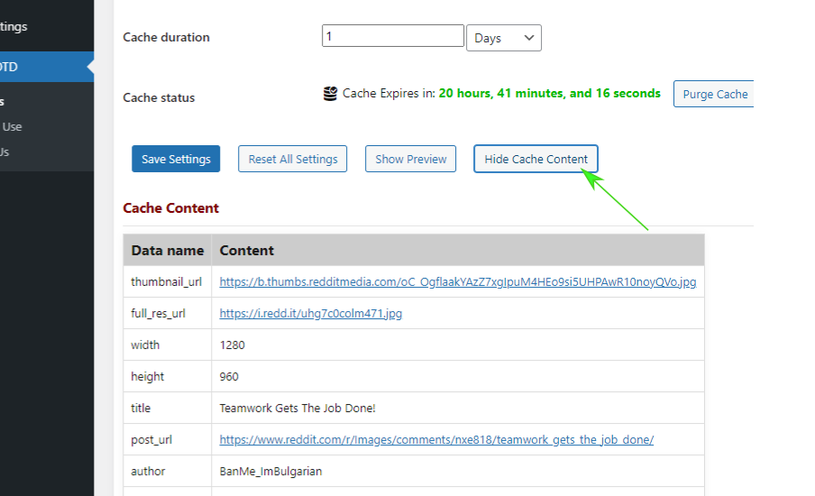
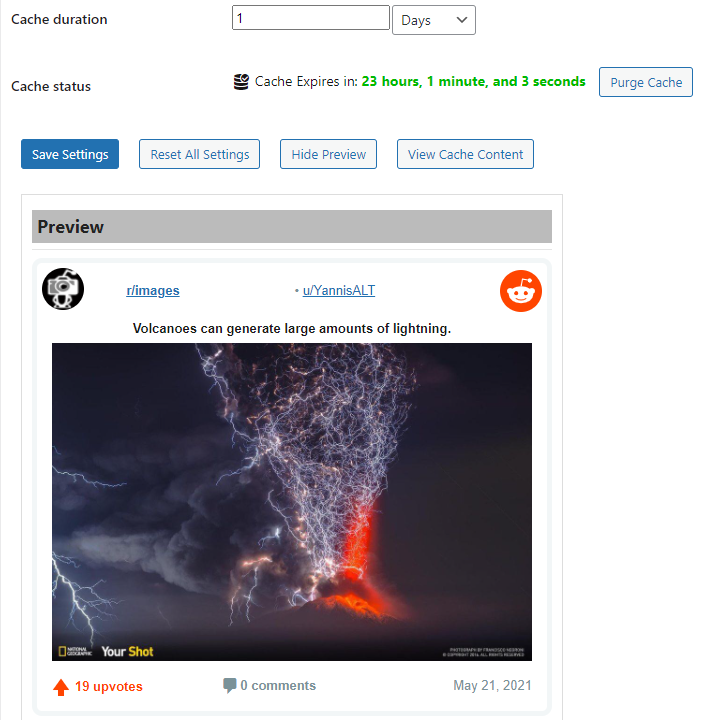

# RIOTD - Reddit Image Of The Day

Contributors: SyDream  
Tags: feed, reddit, subreddit, image, gallery, developer  
Requires at least: 5.0.2  
Requires PHP: 5.6.39  
Tested up to: 5.7  
Stable tag: 1.0.0  
License: GPLv3  
License URI: https://www.gnu.org/licenses/gpl-3.0.html  

Image of The Day from any sub/Reddit in your WordPress widgets and posts

## Description

Whether you own a subreddit channel and wants to showcase the images posted, or you are passionate about some of the many topics discussed in a subreddit and wants to show some images from there in your posts or your website, 
this plugin is for you. It will scrape images from a subreddit channel of your choice, and display it on your website through a text widget or in any of your post where you would use the shortcodes available. The images are fetched
based on criteria you can setup in the settings, you can choose between two layout or simply grab the image url and use it anywhere you want.

### Features

 * Image scraping from selected subreddit channel
 * Image resolution and aspect ratio definition
 * Allow to select safe content as marked by Reddit (see Privacy note below for more information)
 * Image metadata and scraping is cached
 * Various method of image selection (daily, random, etc.)
 * Custom CSS override option
 * Various layout options to display the widget
 * All metadata can be extracted individually and integrated in posts and pages
 * Multi language support (translators are welcome)

### Usage

 * Activate the Plugin, this will initialize all the settings to default
 * Visit the *Plugin Setting* page from the sidebar **RIOTD > Settings**
 * Configure the subReddit channel you want to select images from in *Settings > Configure Reddit Channel*
 * Configure all other options relevant to your needs or leave the default
 * Add the shortcode **[RIOTD]** to a text-widget to show the image box on your page or in a post
 * Add the shortcode **[RIOTD-DATA key="xxx"]** to a posts to show the related metadata (including the image url) in any post or widget
 * Visit the **RIOTD > How To Use** page from the sidebar for the full documentation

### Screenshots
 1. Configure subReddit channel in Settings 
 2. Configure image resolution and aspect ratio 
 3. Configure layout options and custom CSS 
 4. Configure general settings 
 5. Show widget preview 
 6. Show cache content 
 7. Show reddit compliant widget preview 

### Help and Support
Although a lot of care has gone into thoroughly testing this plugin, we couldn't possibly cover all cases and different setup scenario, so please bear with us while we improve and fix any issues that you will report.

Would you have any issue with the plugin, or if you want to request a new feature to be implemented, please open a [new ticket](https://github.com/tommasodargenio/wp-riotd/issues/new/choose) on the repository issue's section.

Support is provided on best-effort basis, please upload screenshots to show the issue, the debug information shown in the column below called Debug Checkup, and any relevant information to help expedite troubleshooting and resolution.

We would love to hear any feedback and constructive criticisms that could help us improve this plugin and create new one, feature requests will be assessed based on the project's roadmap and mission statement and feedback provided if we decide to implement it or else.                

### Disclaimer
This plugin and its code is provided *as-is* without warranty of any kind, either express or implied, including any implied warranties or fitness for a particular purpose, merchantibility, or non-infringement.

Reddit is a copyright of Reddit Inc., please refer to Reddit user agreement [website](https://www.redditinc.com/policies/user-agreement) for further details

It is your responsibility to follow Reddit [branding](https://www.redditinc.com/brand) [guidelines](https://www.redditinc.com/assets/press-resources/broadcast_2020.pdf) when posting data from their feed, RIOTD has a preformatted widget style compliant with the afore mentioned guidelines however it is up to you whether to use it or not

*If you are looking to feature any content from a post as standalone asset, you'll need to contact the original poster*

### Privacy Statement

* We do not collect or store any personal or usage information, the data fetched from Reddit is publicly available and exported via Reddit JSON RSS feed.
* The post from Reddit where the image is selected, contains the username of the post's author which you can choose not to display on your Website. **(always read and respect the author's copyright terms)**
* Images not stored on Reddit but on 3rd party hosting sites will not be selected
* Galleries and Videos will not be selected
* The image's content is never analyzed, we rely on Reddit's flags to determine whether or not the image has adult content, you can choose to display such content or not with the related flag (*Allow NSFW content*) in the general settings area. The content of images shown on your website and fetched through this plugin is your sole responsibility
* All data is stored on your Website at all time (in the wp_options table within the WordPress database), the lifetime of the data within this table is limited and it can be purged at anytime by using the control on the general settings page.
* The plugin do not transfer or send any of the data collected (in its entirity or partially) anywhere outside your website.
* If you would like to check the data that the plugin has collected from Reddit and stored in the database, you can use the *Show Cache Content* button on general settings page

* Reddit Inc. has the ownership of the post from which the image has been fetched, please refer to [Reddit](https://www.redditinc.com/policies/privacy-policy) privacy policies for more information on how this data is treated.

